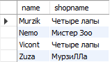
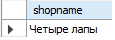
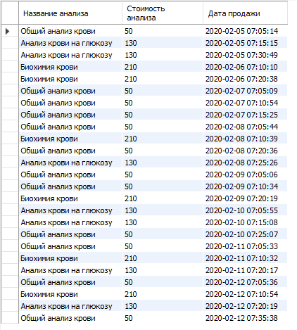
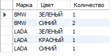

# Вывести всех котиков по магазинам по id (условие соединения shops.id = cats.shops_id)

    SELECT c.name, s.shopname
    FROM cats c
    INNER JOIN shops s ON c.shops_id = s.id;

# Вывести магазин, в котором продается кот “Мурзик” (попробуйте выполнить 2 способами)

    SELECT s.shopname
    FROM cats c
    INNER JOIN shops s ON c.shops_id = s.id
    WHERE c.name = 'Murzik';   

    SELECT s.shopname
    FROM shops s 
    JOIN (SELECT shops_id
    FROM cats WHERE name = 'Murzik') AS c
    ON s.id = c.shops_id;

# Вывести магазины, в которых НЕ продаются коты “Мурзик” и “Zuza”

    SELECT DISTINCT s.shopname
    FROM shops s 
    LEFT JOIN (SELECT DISTINCT shops_id
    FROM cats WHERE name = 'Murzik' || name = 'Zuza') AS c
    ON s.id = c.shops_id
    WHERE c.shops_id IS NULL;

# Bывести название и цену для всех анализов, которые продавались 5 февраля 2020 и всю следующую неделю

    SELECT 
	    a.an_name AS 'Название анализа',
	    a.an_price AS 'Стоимость анализа',
        o.ord_datetime AS 'Дата продажи'
    FROM orders o
    INNER JOIN analysis a 
    ON o.ord_an = a.an_id
    WHERE 
	    o.ord_datetime > '2020-02-05' &&
	    o.ord_datetime < '2020-02-13' 
    ORDER BY o.ord_datetime;

# Вывести на экран сколько машин каждого цвета для машин марок BMW и LADA

    SELECT 
	    mark AS 'Марка',	
        color AS 'Цвет',
        COUNT(color) AS 'Количество'
    FROM auto
    WHERE mark = 'BMW' || mark = 'LADA'
    GROUP BY mark, color
    ORDER BY mark;
